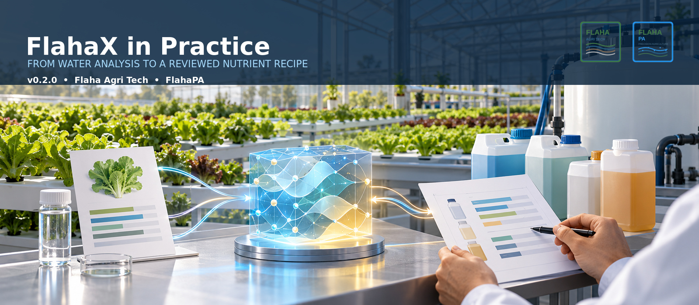

# FlahaX



[](https://pypi.org/project/flahax/)
[](https://pypi.org/project/flahax/)
[](LICENSE)

FlahaX selects a fertilizer combination and the grams of each salt for a fixed crop formula. Version 0.2.0. The formula stays as written. This season’s water is subtracted from it, and the salts cover the gap that remains. Every real salt in the shipped library is a candidate. Non-negative grams decide which salts stay in the mix.

The package is separate from the FlahaFAST application. FlahaFAST does not import it.

The repository also provides bounded chemistry and delivery-planning APIs. These extend the nutrient recipe without changing `recommend` or the CLI. Repository capabilities below describe this branch; they do not imply that a new version has been published to PyPI.

## Chemistry and delivery planning

| Capability | Verified boundary |
|---|---|
| Mixed fertilizer equilibrium (P2/P3) | All 28 catalogue conversions feed one model with 197 aqueous entries and 28 phases; 25 °C, Davies ionic strength <= 0.1 mol/kg water, fixed oxidation states. |
| Catalogue trace products | Fe-DTPA and Fe-o,o-EDDHA are Fe-only 1:1 products; Fe/Mn/Zn/Cu-EDTA retain their declared forms. CH-micro adds those EDTA forms, borax and sodium molybdate. |
| Nitric-acid target pH | Initial and target states use the same mixed solver, with added nitrate and closed analytical inorganic carbon. The result is an initial dose estimate requiring post-mix measurement. |
| Equilibrium-to-delivery adapter (P5.5) | `plan_equilibrium_delivery` returns `EquilibriumPhPlan`: explicit water mass, catalogue doses, HNO3 assay/density, bounded reagent volume, nutrient rescoring and auditable source hashes. |
| Reviewed delivery composition | Both equilibrium and measured-curve pH plans compose with stock and calibrated pump-planning values. Missing inputs, incompatible commands, target supersaturation or formed solids prevent validation. No hardware is operated. |

Recipes use **g/L of final solution**; chemistry uses **g/kg water** and molal analytical totals. They are not interchangeable. The delivery adapter requires explicit final solvent mass and make-up volume, including reagent carrier water. Stock rules, solubility limits, water records and reagent assays are caller-supplied evidence—not universally certified catalogue data.

See the [runnable equilibrium-delivery example and API contract](docs/package-verification.md), [chemistry coverage matrix](docs/chemistry-coverage-matrix.md), and [reference fixtures](docs/reference-fixtures.md).

## Verification status and next steps

Local verification on Python 3.13 passes **107 tests with zero skips**, including pinned PHREEQC live replay. Clean wheel and source-distribution installs pass outside the checkout, including data hashes, public imports, numerical examples and both CLI entry points. PHREEQC is an external verification tool, not a runtime dependency or bundled executable.

**Assessor: Rafat Al Khashan.** The owner-amended G6 assessment concerns bounded computational evidence without laboratory work. It is not an independent review, a formal proof for arbitrary inputs, or operational certification. See the [computational assessment](docs/computational-review.md) and [release evidence](docs/release-evidence.md).

Next, in order:

1. Finish **P6.6/P6.7 hosted verification**: observe passing Python 3.11–3.13 distribution jobs and the required pinned live-reference job. The last inspected GitHub run could not start because of an account billing lock; local passes do not close this gate.
2. Review the package increment with **P5.5 implemented** and the amended **G6 computational assessment** recorded. No automatic merge or release publication is implied.
3. Scope **optional P7 integration** only after those gates: a default-off, read-only FlahaFAST interface with contract tests, visible warnings and explicit review. No deployment, database writes or pump control.

The [implementation roadmap](docs/implementation-roadmap.md) tracks exact acceptance and outstanding work.

## Install

Python 3.11 or newer. There are no required third-party runtime dependencies. Distribution verification uses development-only build tooling.

```powershell
py -m pip install flahax
```

A checkout of this repository can be installed for local work:

```powershell
py -m pip install -e .
```

## Quick start

```python
from flahax import load_library, recommend

result = recommend(
    load_library()["salts"],
    targets={"N_NO3": 128, "P": 58, "K": 211, "Ca": 104, "Mg": 40, "S": 54},
    water={"Ca": 20},
)

for salt in result["salts"]:
    print(f"{salt['name']}: {salt['gramsPerLitre']} g/L")
```

The same solve accepts one JSON object on standard input:

```powershell
@'
{"targets": {"N_NO3": 128, "P": 58, "K": 211, "Ca": 104, "Mg": 40, "S": 54}, "water": {"Ca": 20}}
'@ | flahax
```

`result["salts"]` lists each chosen salt and its `gramsPerLitre`. `result["rows"]` lists each element with its target, the final concentration in ppm, and `deltaPct`. Grams are for one litre of the solution the plant sees.

Element symbols follow the formula database: `N_NO3`, `N_NH4`, `P`, `K`, `Ca`, `Mg`, `S`, `Fe`, `Mn`, `Zn`, `B`, `Cu`, `Mo`.

## Worked example

Edited pepper targets, with 20 ppm calcium already in the water, stay inside 1% on every targeted element. The fit uses six salts:

| Salt | g/L |
|---|---:|
| Potassium nitrate | 0.546 |
| Magnesium nitrate | 0.415 |
| Calcium sulfate | 0.290 |
| Phosphoric acid (75%) | 0.146 |
| Calcium nitrate (ag grade) | 0.046 |
| Calcium monobasic phosphate | 0.048 |

The ppm equation, the Lawson–Hanson solve, the library counts, and the regression case are in [docs/method.md](docs/method.md).

## Citation

Please cite FlahaX when the package, or a recommendation it produced, is used in a report or a paper.

Al Khashan, R. A. (2026). *FlahaX* (Version 0.2.0) [Computer software]. https://pypi.org/project/flahax/

```bibtex
@software{alkhashan2026flahax,
  author  = {Al Khashan, Rafat A.},
  title   = {FlahaX: fertilizer salt selection for a fixed crop formula},
  year    = {2026},
  version = {0.2.0},
  url     = {https://pypi.org/project/flahax/},
  license = {Flaha Free Use License}
}
```

GitHub reads [`CITATION.cff`](CITATION.cff) for the “Cite this repository” button. That file carries the same record.

## Documentation

| Document | Contents |
|---|---|
| [docs/usage.md](docs/usage.md) | Library call, command line, inputs, and result fields |
| [docs/method.md](docs/method.md) | ppm equation, solver, library file, and the pepper proof |
| [INTEGRATION.md](INTEGRATION.md) | Calling FlahaX from FlahaFAST without changing the current flow |
| [docs/delivery-control-design.md](docs/delivery-control-design.md) | Technical frame for future stock tanks, pH, and dosing control |
| [docs/implementation-roadmap.md](docs/implementation-roadmap.md) | Trackable delivery-system implementation plan and acceptance gates |
| [docs/delivery-contracts.md](docs/delivery-contracts.md) | P0 versioned delivery-planning input contracts and audit records |
| [docs/delivery-quantities.md](docs/delivery-quantities.md) | P1 unit-safe batch adaptation and reagent nutrient contributions |
| [docs/stock-planning.md](docs/stock-planning.md) | P2 conservative stock-tank planning and bench-validation protocol |
| [docs/ph-planning.md](docs/ph-planning.md) | P3 titration-bounded pH planning and mandatory verification |
| [docs/reference-fixtures.md](docs/reference-fixtures.md) | Dependency-free PHREEQC golden-fixture verification baseline |
| [docs/equilibrium-kernel.md](docs/equilibrium-kernel.md) | First internal activity/speciation kernel verified against PHREEQC |
| [docs/full-fertilizer-chemistry.md](docs/full-fertilizer-chemistry.md) | Major-ion chemistry coverage and fixture-first expansion plan |
| [docs/fertilizer-equilibrium-model.md](docs/fertilizer-equilibrium-model.md) | P2/P3 macronutrient equilibrium equations, PHREEQC evidence, and explicit chelate boundary |
| [docs/release-evidence.md](docs/release-evidence.md) | Automated delivery-planner evidence, explicit scientific gates, and release boundary |
| [docs/package-verification.md](docs/package-verification.md) | Clean wheel/sdist verification, pinned live reference tooling, and runnable equilibrium-delivery API example |
| [docs/computational-review.md](docs/computational-review.md) | Owner-amended G6 computational assessment, named assessor and limits of acceptance |
| [docs/chemistry-coverage-matrix.md](docs/chemistry-coverage-matrix.md) | Exact aqueous/phase coverage, naming aliases and source-backed definitions |
| [docs/publishing.md](docs/publishing.md) | Building and releasing a new version |

From a checkout, the tests are:

```powershell
$env:PYTHONPATH = 'src'
py -m unittest discover -s tests -t .
```

For required live-reference verification on Windows, provision the pinned external tool and fail rather than skip if unavailable:

```powershell
./tools/provision_phreeqc.ps1
$env:FLAHAX_REQUIRE_PHREEQC = '1'
$env:PYTHONPATH = 'src'
py -3.13 -m unittest discover -s tests -t .
py -m compileall -q src tools
git diff --check
```

For isolated distribution checks, use a development virtual environment with `build` installed and run `python tools/verify_distribution.py`. It creates temporary wheel/sdist installations and writes `build/distribution-verification.json`; nothing is published. Without PHREEQC, ordinary runs still execute checked-in golden regressions but may skip live replay.

## Scope of version 0.2.0

This version returns grams for one litre of working solution. A salt is dosed from the shipped library only when its assay uses known ions and its formula does not rule the assay out. Default recipes leave out carbonate salts, and they leave out sodium and chloride unless the formula asks for that ion or the caller allows it. The result reports whether every requested ion landed inside 1%, plus warnings.

The core `recommend` and CLI contract does not split tanks, adjust pH, price the mix, or apply a concentration factor. Separate Python planning APIs provide stock assignment, bounded pH calculations and reviewed delivery composition as described above. They do not physically adjust pH, execute dosing commands or write to the FlahaFAST database.

## License

Use of FlahaX is free of charge, including commercial use, under the [Flaha Free Use License](LICENSE). That license permits installation and running of an official copy. Modification, forking, republishing, and giving copies to anyone else require permission from the copyright holder. The license is a proprietary free-use license.
